# Room database schema diagram

This diagram shows the `:android:database` schema at **version 38**, except the feed crib section,
which is updated to **version 47** (drawn from `47.json`: `feed_cribs`, `crib_reading_codes` and
`feed_crib_entries` replace the old stub tables). The rest was drawn from
`android/database/schemas/com.beeftech.database.BeefTechDatabase/38.json`, which lists 44 tables.

How to read it:

- Solid lines are foreign keys the database enforces. Each is labelled with its `ON DELETE` action.
- Dotted lines are links the code relies on but no foreign key enforces.
- `UK` marks a column covered by a unique index.

To keep the diagram readable, it leaves out the audit and sync columns that most synced tables repeat:

- `record_guid` (unique on every table that has it)
- `gps_lat` / `gpsLat` and `gps_lng` / `gpsLng`
- `captured_at` / `captureAt`
- `sync_status` / `syncStatus` and `synced_at` / `syncedAt`

The exported schema JSON is the source of truth. When `BeefTechDatabase.VERSION` is bumped,
update this diagram from the new JSON.

A rendered copy is in [`schema-diagram.svg`](schema-diagram.svg). To regenerate it, copy the

```mermaid
erDiagram
    %% ---------- Animals core ----------
    animals {
        string animalId PK
        int birthdate
        string breed FK
        string gender
        string hideColour FK
        string brandMark
        string dam_id FK
        string sire_id FK
        string deviceId FK
    }
    animal_identifiers {
        string identifier_id PK
        string animal_id FK
        string identifier_type FK
        string identifier_value
        int valid_from
        int valid_to
    }
    animal_media {
        string media_id PK
        string animal_id FK
        string file_path
        string media_type
        int created_at
    }
    animal_weights {
        string weight_id PK
        string animal_id FK
        real weight_kg
        int weigh_date
        string body_condition_score
        string notes
        string device_id FK
    }
    animal_ownerships {
        string ownership_id PK
        string animal_id FK
        string owner_name
        real ownership_percentage
        int start_date
        int end_date
    }
    animal_purchases {
        string purchase_id PK
        string animal_id FK
        real purchase_price
        int purchase_date
        string seller_name
        string supplier_farmer_id "no FK"
        string gln_number
        string purchase_batch_number
        string notes
    }
    calf_registrations {
        string registration_id PK
        string registered_animal_id FK, UK
        string dam_id FK
        string sire_id FK
        real birth_weight_kg
        string calving_ease
        int registration_date
    }
    animal_groups {
        string animalGroupId PK
        string groupName UK
        string description
    }
    animal_group_memberships {
        string membership_id PK
        string animal_id FK
        string group_id FK
        int joined_at
        int left_at
    }

    %% ---------- Farm traceability ----------
    animal_movements {
        string movement_id PK
        string animal_id FK
        string source_farm_id
        string source_pen_id
        string destination_farm_id
        string destination_pen_id
        int movement_date
        string feed_location_type
        string notes
        string device_id FK
    }
    treatments {
        int id PK
        string animalId FK
        string disease FK
        string treatmentName
        string batchNumber
        string volumeUsed
        real cost
        int timestamp
        string deviceId FK
        int withdrawal_clear_date
    }
    mortalities {
        int id PK
        string animalId FK, UK
        string causeOfDeath
        string necropsy_code_id FK
        string responsibleWorker
        string notes
        int timestamp
    }
    animal_costs {
        int id PK
        string animalId FK
        string costType FK
        real amount
        string description
        int timestamp
        string source_entity UK "UK with source_record_id"
        string source_record_id UK
    }

    %% ---------- Reference / lookup ----------
    breeds {
        string breedId PK
        string name
    }
    hide_colours {
        string colourId PK
        string name
    }
    diseases {
        string diseaseId PK
        string name
    }
    necropsy_codes {
        string necropsyCodeId PK
        string code
        string description
    }
    cost_types {
        string code PK
        string display_name
        int sort_order
        int is_active
    }
    identifier_types {
        string code PK
        string name
        string validation_regex
    }
    medications {
        string medicationId PK
        string name
        int withdrawal_period_days
    }
    medication_batches {
        string batchId PK
        string medicationId FK
        string batch_number
        int expiry_date
    }
    countries {
        string countryId PK
        string iso_code
        string name
    }
    provinces {
        string provinceId PK
        string countryId FK
        string name
    }
    reference_items {
        string kind PK
        string item_key PK
        string display_name
        int active
        int sort_order
        int server_id
        int updated_at
    }
    rations {
        string ration_id PK
        string name UK
        int active
    }
    locations {
        string location_id PK
        string location_code
        string location_name
        string location_type
    }
    pens {
        string id PK
        string name
    }

    %% ---------- Farmers ----------
    farmers {
        string farmer_id PK
        string client_code
        string organisation_name
        string vat_number
        string email_address
        real gps_latitude
        real gps_longitude
        string co_reg_id_no
        string land_ownership
        string fa_code_rmis
        string gln_number
    }
    farmer_addresses {
        string address_id PK
        string farmer_id FK
        string address_type
        string address_line_1
        string province FK
        string postal_code
        string street_code
        string postal_address
        string country
    }
    farmer_business_roles {
        int business_role_id PK
        string business_role_name UK
    }
    farmer_roles {
        string farmer_role_id PK
        string farmer_id FK "UK with role_id"
        int role_id FK
    }

    %% ---------- Feed crib ----------
    feed_cribs {
        string crib_number PK
        string site_id
        string pen_description
        string ration
        string method
        string description
        real required_kg
        int animals_begin
        int animals_in
        int animals_out
        int animals_close
        real current_adi
        bool active
        long updated_at
        long last_downloaded_at
    }
    crib_reading_codes {
        int code PK
        string label
        string description
        bool active
    }
    feed_crib_entries {
        string record_guid PK
        string crib_number "link, no FK"
        string site_id
        string reading_date
        string slot "MORNING, MIDDAY, EVENING"
        int code "link"
        real adi
        string device_id
        string user_id
        string origin "LOCAL or SERVER"
        string sync_error
        int sync_attempts
    }

    %% ---------- Users, devices, auth ----------
    roles {
        int role_id PK
        string role_name UK
    }
    users {
        string user_id PK
        string username UK
        string pin_hash
        int failed_pin_attempts
        int role FK
        string device_assigned_id "no FK"
        int device_last_sync
        int failed_sync_attempts
        string site_id
    }
    devices {
        string deviceId PK
        string device_assigned_id
        string model
        int last_sync
    }
    device_config {
        string config_key PK
        string value
        int updated_at
    }

    %% ---------- Sync infrastructure ----------
    pending_sync {
        int id PK
        string user_id "no FK"
        string entityType
        string entityId
        string operation
        string payload
        int createdAt
        int retryCount
    }
    sync_batches {
        string id PK
        int timestamp
    }
    sync_backups {
        string id PK
        string batchId FK
        string sync_status
    }
    sync_policy_state {
        string user_id PK "no FK"
        int locked
        int locked_at
        string lock_reason
    }
    sync_security_events {
        int id PK
        string event_key UK
        string user_id "no FK"
        string event_type
        int event_time
        int warning_day
        int pending_count
        int oldest_pending_created_at
        string details
        int uploaded_at
    }

    %% ---------- Relationships (enforced FKs) ----------
    breeds            ||--o{ animals : "breed (RESTRICT)"
    hide_colours      |o--o{ animals : "hideColour (SET NULL)"
    devices           ||--o{ animals : "deviceId (RESTRICT)"
    animals           |o--o{ animals : "dam_id / sire_id (SET NULL)"

    animals ||--o{ animal_identifiers       : "CASCADE"
    animals ||--o{ animal_media             : "CASCADE"
    animals ||--o{ animal_weights           : "CASCADE"
    animals ||--o{ animal_ownerships        : "CASCADE"
    animals ||--o{ animal_purchases         : "CASCADE"
    animals ||--o{ animal_group_memberships : "CASCADE"
    animals ||--o{ animal_movements         : "CASCADE"
    animals ||--o{ treatments               : "CASCADE"
    animals ||--o{ animal_costs             : "CASCADE"
    animals ||--o| mortalities              : "CASCADE, 1 per animal"
    animals ||--o| calf_registrations       : "registered_animal_id (CASCADE)"
    animals |o--o{ calf_registrations       : "dam_id / sire_id (SET NULL)"

    identifier_types ||--o{ animal_identifiers       : "RESTRICT"
    animal_groups    ||--o{ animal_group_memberships : "RESTRICT"
    devices          ||--o{ animal_movements         : "RESTRICT"
    devices          ||--o{ animal_weights           : "RESTRICT"
    devices          ||--o{ treatments               : "RESTRICT"
    diseases         ||--o{ treatments               : "RESTRICT"
    necropsy_codes   |o--o{ mortalities              : "SET NULL"
    cost_types       ||--o{ animal_costs             : "RESTRICT"
    medications      ||--o{ medication_batches       : "CASCADE"
    countries        ||--o{ provinces                : "CASCADE"
    provinces        |o--o{ farmer_addresses         : "SET NULL"

    farmers               ||--o{ farmer_addresses : "CASCADE"
    farmers               ||--o{ farmer_roles     : "CASCADE"
    farmer_business_roles ||--o{ farmer_roles     : "RESTRICT"

    roles        |o--o{ users        : "SET NULL"
    sync_batches ||--o{ sync_backups : "CASCADE"

    %% ---------- Logical links (no FK constraint) ----------
    farmers |o..o{ animal_purchases     : "supplier_farmer_id"
    users   |o..o{ pending_sync         : "user_id"
    users   |o..o| sync_policy_state    : "user_id"
    users   |o..o{ sync_security_events : "user_id"
    feed_cribs         ||..o{ feed_crib_entries : "crib_number"
    crib_reading_codes |o..o{ feed_crib_entries : "code"
```

mermaid block below into a `.mmd` file and run `mmdc -i <file>.mmd -o schema-diagram.svg`.

